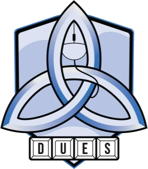
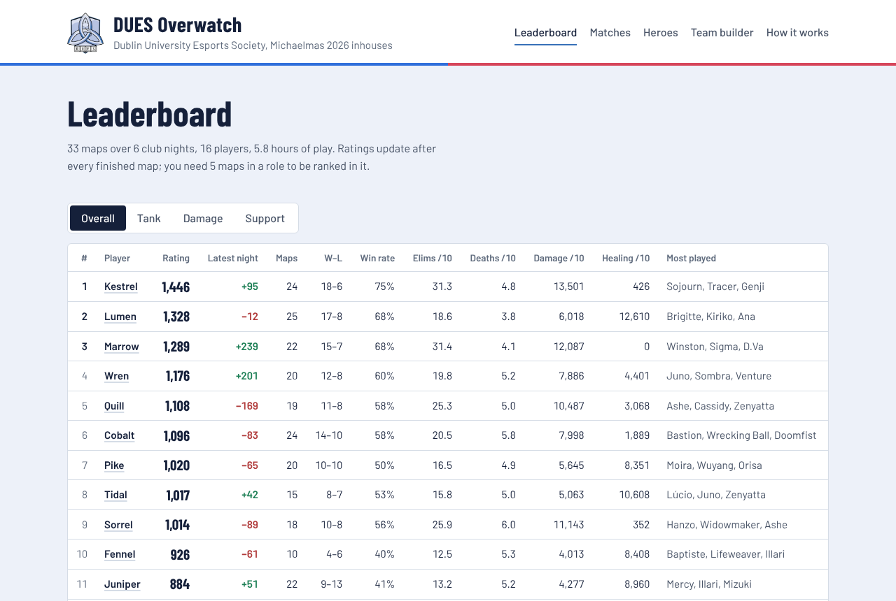
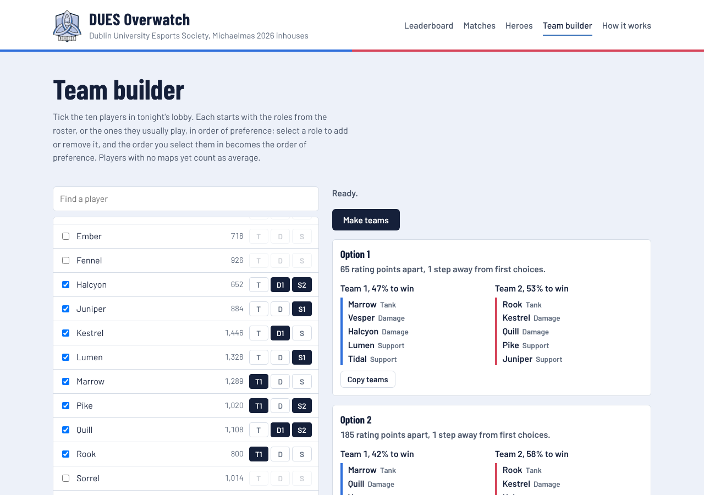

<p align="center"></p>

# DUES Overwatch inhouses

Leaderboards, player profiles and a team builder for the Dublin University Esports Society's Overwatch inhouses, built from the custom games that never show up on public stat sites.

Inhouses are hosted with the ScrimTime Workshop mode, which writes a log file for every map. Add those logs to this repository and GitHub rebuilds the website: a ladder for each role, a profile for every member, a scoreboard for every map, and a team builder that splits the night's lobby into the fairest 5v5.



*Screenshots use an invented sample season. The live site starts empty and fills in as logs are added.*

Inspired by [Blueward](https://github.com/Kickblip/blueward), which does the same for League of Legends clubs.

## What it does

- **Ratings per role.** After every finished map, winners go up and losers go down, more so when the result was a surprise. Everyone has an overall rating and one each for tank, damage and support, decided by the hero they spent most of the map on. The model is Plackett-Luce from [openskill](https://github.com/vivekjoshy/openskill.py), a Bayesian rating in the TrueSkill family.
- **Profiles.** Rating history, heroes with per-10-minute stats, best teammates, and every map played.
- **Match pages.** Both scoreboards, each player's rating change, and what the ratings predicted beforehand. Results the ratings gave less than a 35% chance are flagged as upsets.
- **Team builder.** Tick ten players and their roles; it checks every legal 1-2-2 split and shows the three most even, with each side's win chance and a button to copy the teams into Discord. Newcomers can be added on the night. It runs in the browser, so it works from a phone in the lobby.



## Recording a night's games

**The host's game settings, once:**
1. Load the [ScrimTime](https://workshop.codes/FYHQV) mode by Caldoran in the custom game, and turn on its Log Generator and Player Stat Summary in the Workshop settings.
2. In Overwatch, enable *Options > Gameplay > Enable Workshop Inspector Log File*. Only the host's game writes logs.

Each map is saved as `Documents/Overwatch/Workshop/Log-YYYY-MM-DD-HH-MM-SS.txt`.

**Then add the logs, whichever way is easiest:**

- **Upload on GitHub, no installs.** Open the `logs` folder in this repository on github.com, choose *Add file > Upload files*, drag in the night's logs (or the whole folder), and commit. The site updates a minute or two later.
- **Double-click on the host's PC.** `import-logs.bat` copies new logs from the Workshop folder into `logs/`, adds any new players to the roster, and pushes. It needs Python and Git installed and `pip install -r requirements.txt` run once.
- **From a terminal.** `python -m overtime import` does the same copy from the Workshop folder; pass a folder, some files or a `.zip` instead if the logs came from someone else, e.g. `python -m overtime import ~/Downloads/inhouse-logs.zip`.

Importing is safe to repeat: other Workshop logs are ignored, maps already in `logs/` are skipped, and new maps are filed into one folder per night.

## Players

`config/players.csv` is the roster. Open it in Excel or Google Sheets:

| name | ingame_names | roles |
| --- | --- | --- |
| Aoife | Aoife#1234; AoifeSmurf | support>damage |
| Cian | CianOW | tank |

- **name** is what the site shows.
- **ingame_names** lists every account the person plays on, separated by `;`. BattleTags are fine; the `#1234` part is ignored.
- **roles** sets their preferences for the team builder, best first. Leave it blank to use what they actually play.

Anyone not on the roster still appears, under their in-game name. To catch them, `python -m overtime players` lists names in the logs that aren't on the roster, and `python -m overtime players --add` appends them as rows to tidy up. A sign-up form export can be pasted in directly: columns headed Player, BattleTag or Preferred roles are recognised too.

## Setting up the website

1. Push this repository to GitHub.
2. Open *Settings > Pages* in the repository and set *Source* to *GitHub Actions*.
3. Open *Actions*, choose *Build site*, then *Run workflow*.

Every push to `main` now runs the tests, rebuilds the site and publishes it at the address shown under *Settings > Pages*. Edit `config/club.yaml` to change the season name, logo or the minimum maps to be ranked.

## Run it locally

Needs Python 3.10 or newer.

```
pip install -r requirements.txt
python -m overtime build                     # writes the site to site/
python -m overtime teams examples/signups.csv  # after adding ten players to it
python -m pytest
```

To see a full site before any games are logged, generate the sample season:

```
python scripts/make_demo_logs.py --out demo-logs
python -m overtime --logs demo-logs build --out demo-site
```

## How the ratings work

Each player's skill is held as an estimate and an uncertainty. The number shown is the estimate, on a scale where everyone starts at 1,000; the uncertainty drives the win probabilities. A team result says little about any one player, so ratings stay jumpy for the first couple of dozen maps, and players need a minimum number of maps (`min_maps` in `config/club.yaml`) before they appear on a ladder. Only results feed the rating: eliminations, damage and healing are displayed but never counted, since a support who keeps their team alive can have quiet numbers on a winning map.

The team builder scores each split by the gap in summed role ratings, plus a cost worth 40 rating points for every step a player sits below their first-choice role, and returns the lowest.

## Project layout

```
config/               club.yaml, logo.png, players.csv, heroes.yaml
logs/                 ScrimTime logs, one folder per club night
import-logs.bat       double-click importer for the host's PC
overtime/parse.py     reads ScrimTime logs into one record per map
overtime/importer.py  copies new logs in and finds new players
overtime/stats.py     season totals, heroes, teammates
overtime/ratings.py   rating updates and win probabilities
overtime/balance.py   the team builder's search (mirrored in static/builder.js)
overtime/site.py      renders the static site from templates/
scripts/              sample-season generator, used by the tests
tests/                parser, roster, import, ratings, balancer and site build
```

## Limitations

- Only maps hosted with ScrimTime, by a host with log files switched on, are recorded.
- A log that stops before the end of the match is listed as unfinished and not rated.
- Ratings from a single term are noisy; treat small gaps as ties.
- The site is public. Members should know their in-game names and stats appear on it.
- New heroes need adding to `config/heroes.yaml`, spelled as the game spells them. The build warns when one is missing.

## Credits

- [ScrimTime](https://workshop.codes/FYHQV) by Caldoran writes the logs. Its event format is also documented by [Parsertime](https://github.com/lucasdoell/parsertime), whose sample logs were used to check this parser.
- [openskill.py](https://github.com/vivekjoshy/openskill.py) for the rating model.
- Barlow and Barlow Condensed by Jeremy Tribby, under the SIL Open Font License (`overtime/static/fonts/OFL-Barlow.txt`).
- The DUES crest belongs to the Dublin University Esports Society.

Overwatch is a trademark of Blizzard Entertainment. This project is not affiliated with or endorsed by Blizzard.
